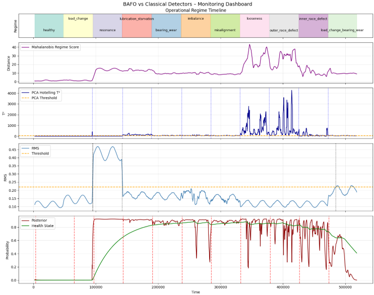
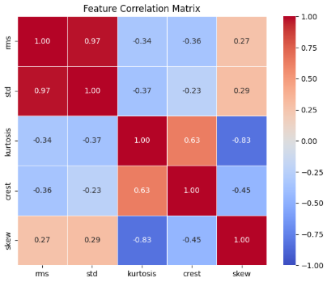
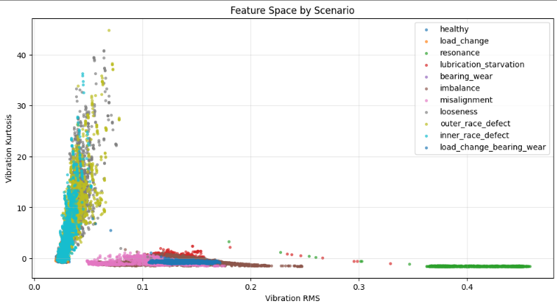
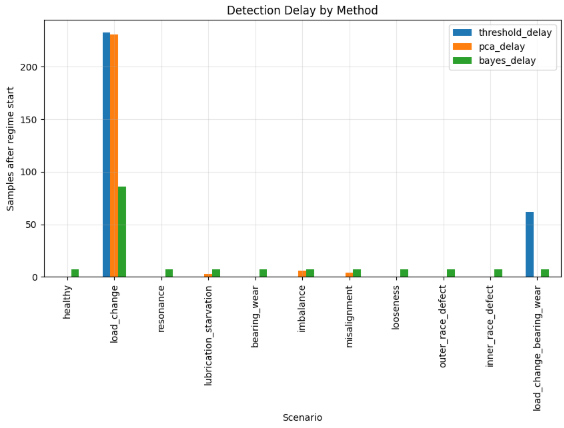
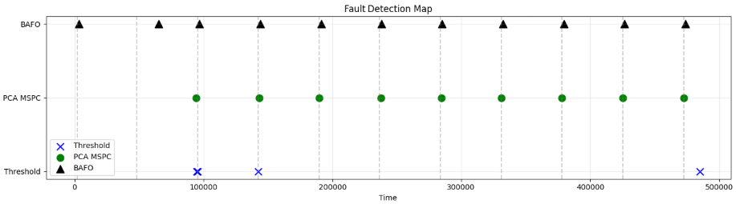

# Bayesian Adaptive Fault Observer (BAFO)



*Monitoring dashboard comparing BAFO with classical vibration monitoring methods.*

A probabilistic monitoring framework for detecting operational regime changes and fault conditions in industrial machinery.

This project presents the development and evaluation of the **Bayesian Adaptive Fault Observer (BAFO)**, a dynamic anomaly detection approach inspired by concepts from **Bayesian inference**, **multivariate statistical monitoring**, and **state observers from control theory**.

The framework is evaluated using a simulated industrial motor model and compared against classical monitoring approaches such as **RMS threshold monitoring** and **PCA-based Multivariate Statistical Process Control (MSPC)**.

---

# Overview

Industrial condition monitoring systems must detect abnormal operating conditions while remaining robust to noise, transient disturbances, and operational variability.

Traditional monitoring approaches typically rely on:

- amplitude thresholds  
- static statistical models  

However, these methods often struggle to detect **regime changes and structural faults** in complex systems.

The **Bayesian Adaptive Fault Observer (BAFO)** addresses this challenge by integrating multivariate statistical monitoring with a probabilistic state observer.

Key features of the proposed framework include:

- Probabilistic fault detection using a **Bayesian state observer**
- Multivariate monitoring based on **Mahalanobis distance**
- Benchmark comparison with **RMS threshold monitoring and PCA–MSPC**
- Simulation of multiple industrial fault regimes
- Visualization tools for **regime transitions and detection dynamics**

Together, these components allow the monitoring framework to detect **regime divergence and fault evolution** while maintaining stability in the presence of transient disturbances.

---

# Feature Engineering

Vibration signals are segmented into temporal windows and converted into statistical descriptors:

- RMS
- Kurtosis
- Crest Factor
- Skewness

A correlation analysis revealed strong redundancy between RMS and standard deviation.



Due to the **high correlation between RMS and STD (ρ ≈ 0.97)**, the STD feature was removed to avoid multicollinearity and improve the numerical conditioning of the covariance matrix used in multivariate monitoring.

---

# Operational Regime Feature Space

The extracted features form a multivariate representation of machine behavior across simulated regimes.



Different simulated fault conditions produce distinct patterns in the feature space.  
This separation allows statistical monitoring methods to identify regime transitions and abnormal operating conditions.

---

# Monitoring Framework

The monitoring pipeline follows four stages:

**Monitoring Pipeline**

Simulation → Feature Extraction → Multivariate Monitoring → Bayesian Observer → Evaluation

### Multivariate Regime Signal

A **Mahalanobis distance-based regime score** is constructed using baseline operating conditions.

This score measures the deviation of the current feature vector from the reference operating regime.

---

## Bayesian Adaptive Fault Observer (BAFO)

The **Bayesian Adaptive Fault Observer (BAFO)** operates as a probabilistic monitoring framework that integrates statistical evidence over time through a state-observer structure.

Conceptually, the algorithm follows four stages:

```
+---------------------+
| Signal Conditioning |
|  smoothing + slope  |
+---------------------+
          ↓
+-----------------------+
| Multivariate Evidence |
|  normalized deviation |
+-----------------------+
          ↓
+--------------------+
|   Bayesian Update  |
|    probabilistic   |
|   inference step   |
+--------------------+
          ↓
+--------------------+
|    Health State    |
|     Observer       |
| degradation state  |
+--------------------+
```

First, the monitoring signal is conditioned through smoothing and derivative estimation to stabilize impulsive disturbances while preserving regime transitions.

The conditioned signal is then converted into **multivariate evidence**, representing the deviation from the healthy operating baseline.

This evidence is integrated through a **Bayesian update step**, which estimates the probability of abnormal operation.

Finally, a **health state observer** smooths the posterior probability to track the long-term evolution of system degradation.

This structure allows the observer to react to regime changes while maintaining robustness to transient disturbances and noise in the monitoring signal.

---

# Monitoring Dashboard

The monitoring dashboard combines multiple signals to evaluate system behavior:

- operational regime timeline
- Mahalanobis regime score
- PCA Hotelling T² statistic
- RMS threshold monitoring
- BAFO posterior and health state


This consolidated view enables direct comparison between the proposed observer and classical detection methods.

---

# Benchmark Methods

The proposed approach is compared with two commonly used monitoring strategies.

### RMS Threshold Monitoring

A classical vibration monitoring method based on amplitude thresholds.

### PCA-Based Multivariate Statistical Process Control (MSPC)

A multivariate monitoring technique using the **Hotelling T² statistic**.

These methods serve as baseline detectors for evaluating BAFO performance.

---

# Detection Performance

### Key Results

- BAFO detected all simulated fault regimes
- Classical RMS thresholds failed to detect several structural faults
- BAFO provided smoother temporal behavior compared to PCA-based MSPC

Detection delay was measured for each simulated regime.



Key observations:

- RMS threshold monitoring fails to detect several structural faults.
- PCA-based MSPC detects most regimes but exhibits sensitivity to transient disturbances.
- BAFO detects all simulated regimes while maintaining smoother temporal behavior.

---

# Fault Detection Map

The fault detection timeline highlights when each detector identifies regime changes.



BAFO demonstrates consistent detection across all simulated regimes while maintaining temporal stability.

---

# Applications

The proposed monitoring framework is applicable to:

- rotating machinery monitoring
- predictive maintenance systems
- industrial SCADA monitoring
- edge-based machine health monitoring
- anomaly detection in industrial processes

---

# Repository Structure

```
BAFO/
│
├── notebooks
│   └── motor_model.ipynb
│
├── figures
│   ├── correlation_matrix.png
│   ├── feature_space.png
│   ├── monitoring_dashboard.png
│   ├── detection_delay.png
│   └── fault_detection_map.png
│
├── src
│
├── README.md
└── requirements.txt
```
Main notebook:  
[Motor Model Notebook](notebooks/motor_model.ipynb)

---

# Author

Victor Dutra  
Control & Automation Engineer  
Industrial Data & Process Analytics
